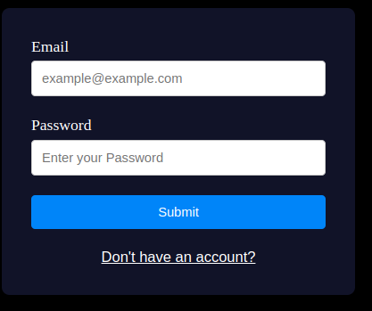

# flask-js-fullstack
This project demonstrates a full-stack web application that integrates a Flask backend with a JavaScript frontend. The application features a login system where users can register and authenticate using their email and password.
#Project Structure





## Getting Started

### Prerequisites
- Python 3.8+
- Node.js and npm (optional, for frontend package management)

### Setup Instructions

#### Clone the repository
```
git clone https://github.com/ITSHAYDER/flask-js-login-system.git
cd flask-js-login-system
```
### Set up the Flask backend

Navigate to the server directory:
```
cd server
```
### Create a virtual environment:
```
python -m venv venv
source venv/bin/activate  # On Windows use venv\Scripts\activate
```
